# Tutorial CPP

## How to make and use Dll in Visual Studio IDE 2022
This is a step-by-step walkthrough that shows how to use the Visual Studio IDE to create your own dynamic link library (DLL) written in C++. Then it shows how to use the DLL from another C++ app. DLLs (also known as shared libraries in UNIX-based operating systems) are a way share a Windows components between multible application. Benefit is to share code and resources, and to shrink the size of your applications.

## Prerequisites
* A computer that runs Microsoft Windows. We recommend the latest version of Windows for the better development experience.
* Installed visual studio. For more information see [install Visual Studio 2022][1]. Make sure that the **Desktop development with C++** workload is checked.

<br>
<div align="center">
	<p align="center">
		<a href="https://github.com/Tirsvad/Tutorial.CPP.How-To-Make-Dll-With-VS2022/blob/master/docs/images/Desktop-development-with-CPP.png">
			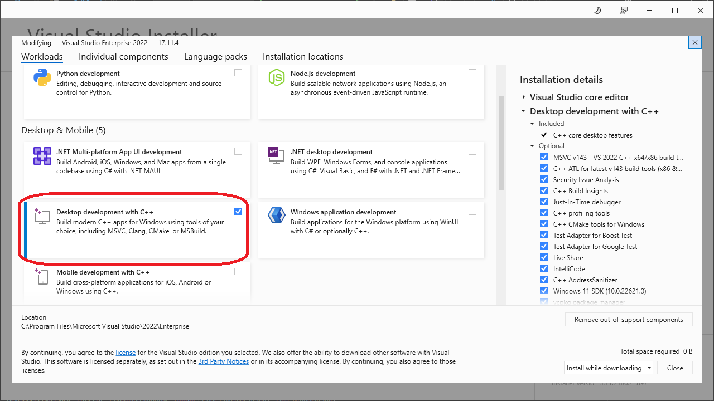
		</a>
	</p>
</div>

## Create the DLL project

<br>
<div align="center">
	<p align="center">
		<a href="https://github.com/Tirsvad/Tutorial.CPP.How-To-Make-Dll-With-VS2022/blob/master/docs/images/Create-new-solution.png">
			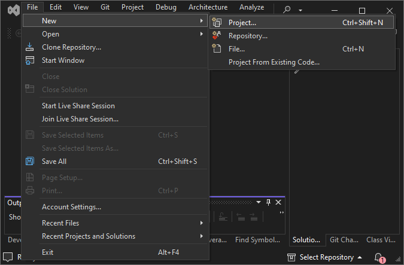
		</a>
	</p>
</div>

1. On the menu bar, choose File > New > Project.

<br>
<div align="center">
	<p align="center">
		<a href="https://github.com/Tirsvad/Tutorial.CPP.How-To-Make-Dll-With-VS2022/blob/master/docs/images/New-project-console-app.png">
			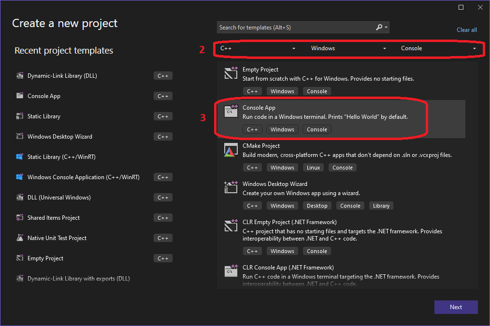
		</a>
	</p>
</div>

2. At the top of the dialog, set Language to C++, set Platform to Windows, and set Project type to Console.
3. From the list of project types, select **Console App**, and then choose Next.

<br>
<div align="center">
	<p align="center">
		<a href="https://github.com/Tirsvad/Tutorial.CPP.How-To-Make-Dll-With-VS2022/blob/master/docs/images/Configure-your-new-project.png">
			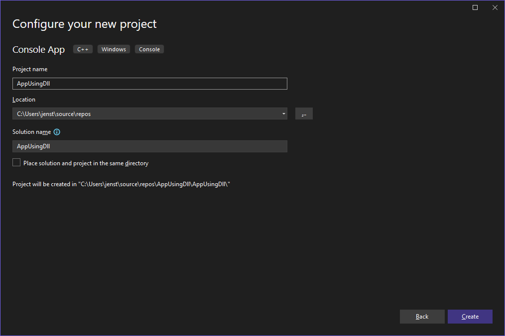
		</a>
	</p>
</div>

4. In the Configure your new project dialogbox, enter AppUsingDll in the Project name box to specify a name for the project. You can leave the default Location and Solution name values. Set Solution to **Create new solution**. Uncheck Place solution and project in the same directory if it's checked.

<br>
<div align="center">
	<p align="center">
		<a href="https://github.com/Tirsvad/Tutorial.CPP.How-To-Make-Dll-With-VS2022/blob/master/docs/images/Create-new-solution.png">
			
		</a>
	</p>
</div>

5. On the menu bar, choose File > New > Project.

<br>
<div align="center">
	<p align="center">
		<a href="https://github.com/Tirsvad/Tutorial.CPP.How-To-Make-Dll-With-VS2022/blob/master/docs/images/New-project-dll.png">
			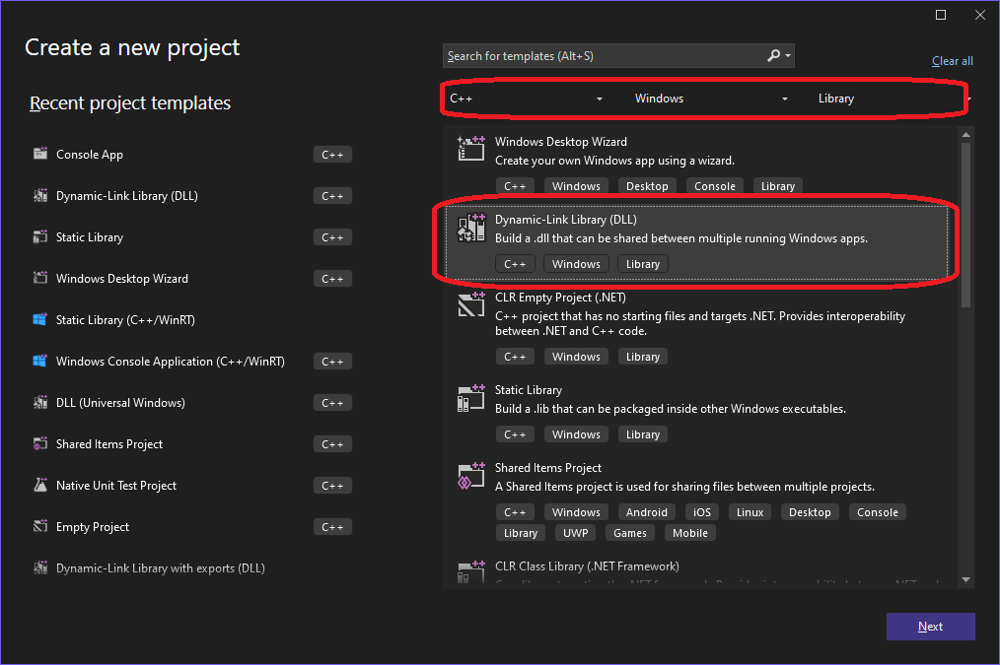
		</a>
	</p>
</div>

6. At the top of the dialog, set Language to C++, set Platform to Windows, and set Project type to Library.
7. From the list of project types, select **Dynamic-link Library (DLL)**, and then choose Next.

<br>
<div align="center">
	<p align="center">
		<a href="https://github.com/Tirsvad/Tutorial.CPP.How-To-Make-Dll-With-VS2022/blob/master/docs/images/Configure-you-new-project-2.png">
			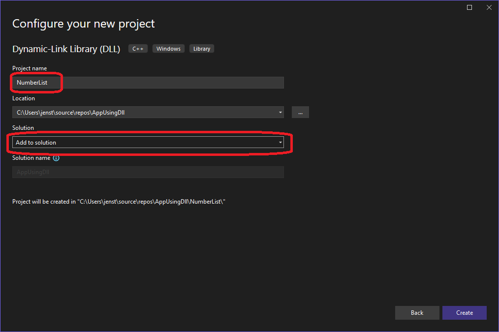
		</a>
	</p>
</div>

8. In the Configure your new project dialogbox, enter NumberList in the Project name box to specify a name for the project. You can leave the default Location. Set Solution to **Add to solution**.

<br>
<div align="center">
	<p align="center">
		<a href="https://github.com/Tirsvad/Tutorial.CPP.How-To-Make-Dll-With-VS2022/blob/master/docs/images/Make-new-class.png">
			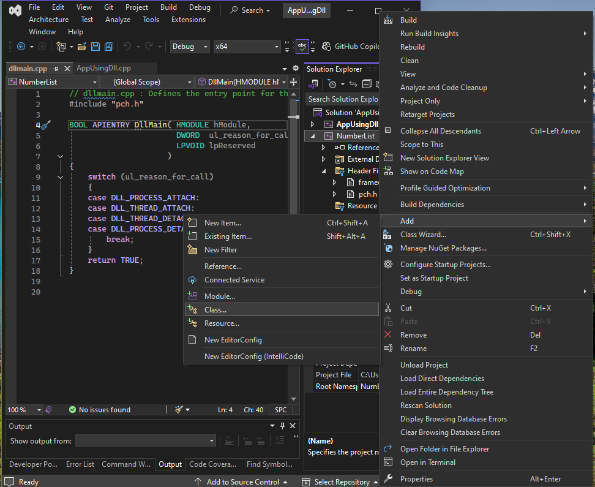
		</a>
	</p>
</div>

9. Create new class we will right click on NumberList in solution explore. Then choose Add > Class in the popup menu.

<br>
<div align="center">
	<p align="center">
		<a href="https://github.com/Tirsvad/Tutorial.CPP.How-To-Make-Dll-With-VS2022/blob/master/docs/images/Name-the-class-as-NumberList.png">
			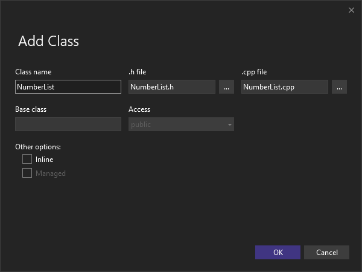
		</a>
	</p>
</div>

10. In Add Class dialogbox we enter NumberList in the Class Name box. Press ok.
11. Now we have a header file (NumberList.h) and a cpp file (NumberList.cpp). In the NumberList.h file we change the code with this

```cpp
// file NumberList.h
#pragma once

#ifndef NUMBERLIST_H
#define NUMBERLIST_H

#include <vector>

#ifdef NUMBERLIST_EXPORTS // NUMBERLIST_EXPORTS is defined by Visual Studio. See projects proberties and in the pane Configurations  Properties > C/C++ > Preprocessor Defininations
#define NUMBERLIST_API    __declspec(dllexport)
#else
#define NUMBERLIST_API    __declspec(dllimport)
#endif

class NumberList
{
public:
    //Constructor
    NUMBERLIST_API NumberList(void);
    //Destructor
    virtual ~NumberList() {}

    //Methods
    NUMBERLIST_API void addToList(int value);
    NUMBERLIST_API std::vector<int> getNumbers() const;

private:
    //Attributes
    std::vector<int> mNumberList;

    //Methods
    void initAttributes() {}
};

#endif // NUMBERLIST_H
```

12. In the NumberList.cpp file we change the code with this

```cpp
// file NumberList.cpp
#include "pch.h"
#include "NumberList.h"

NumberList::NumberList(void)
{
    initAttributes();
}

void NumberList::addToList(int value)
{
    mNumberList.push_back(value);
}

std::vector<int> NumberList::getNumbers() const
{
    return mNumberList;
}

```

13. Right click on NumberList in solution explore. In the popup pane click on build.


<br>
<div align="center">
	<p align="center">
		<a href="https://github.com/Tirsvad/Tutorial.CPP.How-To-Make-Dll-With-VS2022/blob/master/docs/images/Header-not-found.png">
			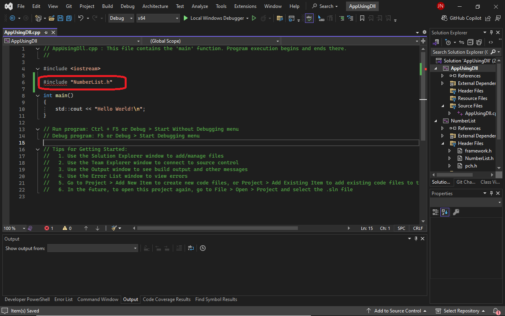
		</a>
	</p>
</div>

14. For now VS don't know where to look for NumberList headers for project AppUsingDll. We need to tell Visual Studio where our AppUsingDll shall look for NumberList headers.

<br>
<div align="center">
	<p align="center">
		<a href="https://github.com/Tirsvad/Tutorial.CPP.How-To-Make-Dll-With-VS2022/blob/master/docs/images/Add-path-to-headers.png">
			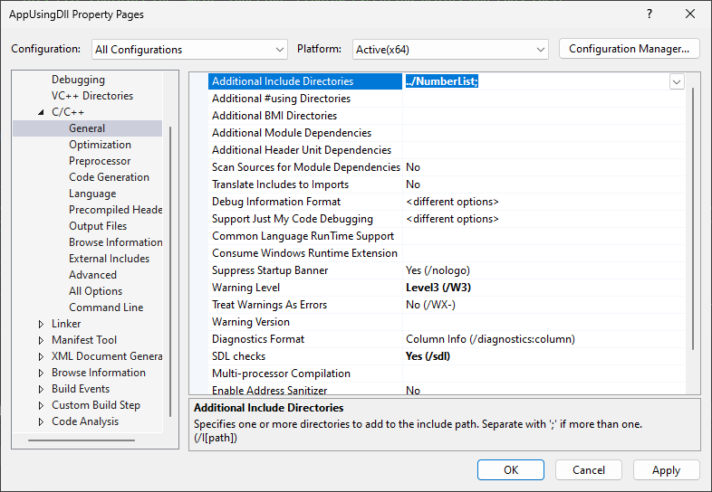
		</a>
	</p>
</div>

15. Right click on AppUsingDll in solution explore pane. In pane last line choose properties. Then in pane under Configuration Properties > C/C++ > General you enter **../NumberList** in Additional Include Directories box.

16. Lets change AppUsingDll.cpp. Replace with following code.

```cpp
// AppUsingDll.cpp : This file contains the 'main' function. Program execution begins and ends there.
//

#include <iostream>
#include <vector>

#include "NumberList.h"

int main()
{
    NumberList obj;
    std::vector<int> r;

    obj.addToList(4);
    obj.addToList(7);

    r = obj.getList();

    std::cout << "Number list result!" << std::endl;
    for (int x : r) // for integer x in vector r
        std::cout << x << " ";

    std::cout << std::endl << "press a key and enter to exit : ";
    char a;
    std::cin >> a;

}
```

<br>
<div align="center">
	<p align="center">
		<a href="https://github.com/Tirsvad/Tutorial.CPP.How-To-Make-Dll-With-VS2022/blob/master/docs/images/Debug-error.png">
			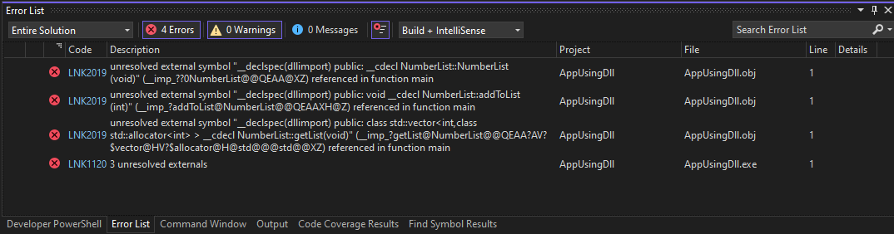
		</a>
	</p>
</div>

17. Press F5. Ups what went wrong! NumberList.lib have to be included in AppUsingDll.

<br>
<div align="center">
	<p align="center">
		<a href="https://github.com/Tirsvad/Tutorial.CPP.How-To-Make-Dll-With-VS2022/blob/master/docs/images/Fix-debug-error.png">
			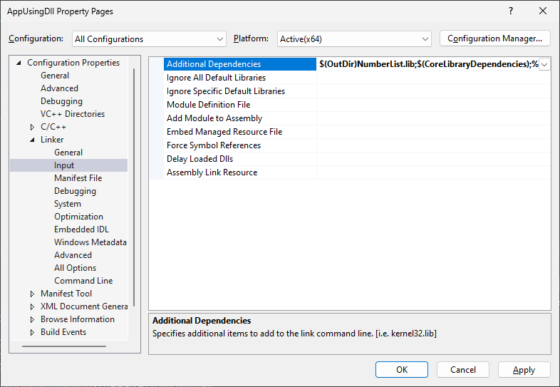
		</a>
	</p>
</div>

18. Right click on AppUsingDll and choose properties (last in the pane). In the dialog windows choose Configuration Properties > Linker > Input > Additional Dependencies and enter **$(OutDir)NumberList.lib;** in the box (dont ovoerwrite existing text).

19. Press F5 and it should work :smile:

[1]: https://learn.microsoft.com/en-us/visualstudio/install/install-visual-studio?view=vs-2022
